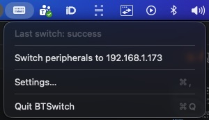
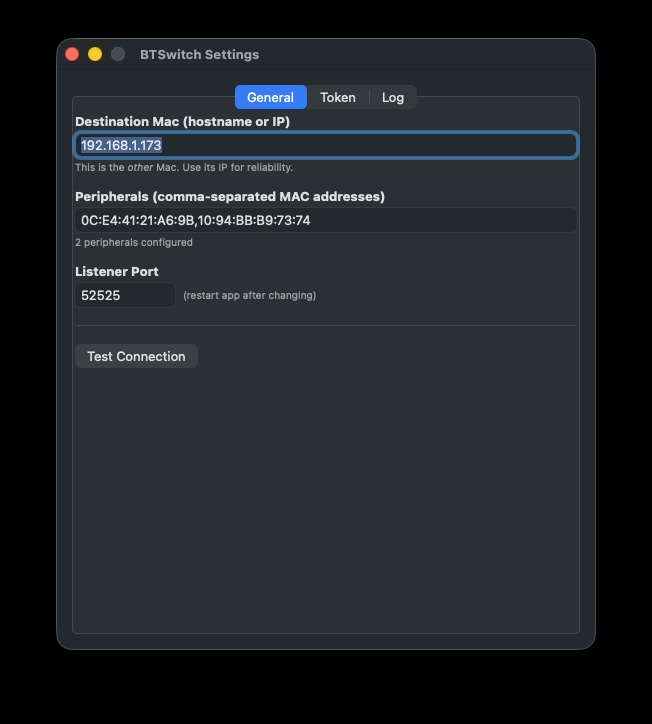
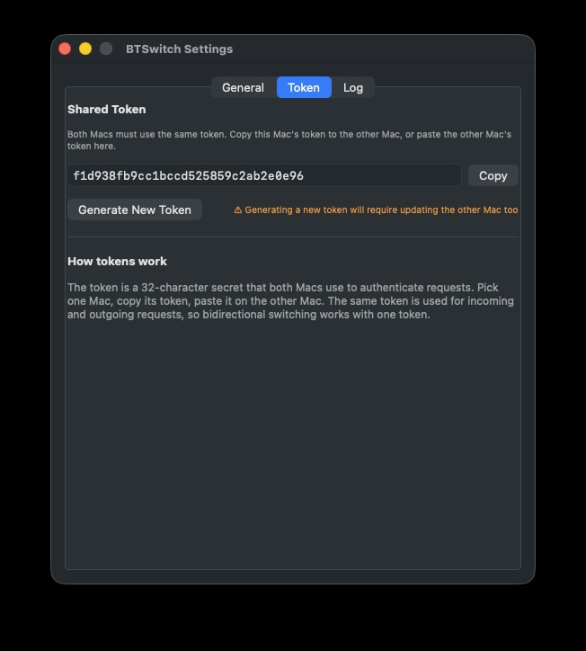
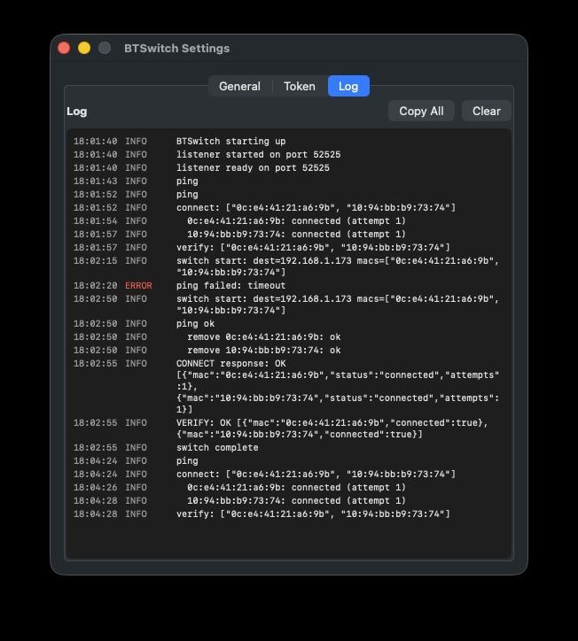

# BTSwitch

A menu bar app that switches your Apple Magic Keyboard, Magic Mouse, and Magic Trackpad between two Macs over your local network.

One click in the menu bar and your peripherals jump to the other Mac. No iCloud account required, no SSH, no kernel extensions, no key remapping.



## Why

If you have two Macs on the same desk — say a personal one and a work one — you've probably tried Universal Control, given up because it doesn't share a single Bluetooth keyboard, tried unpairing/repairing manually, and given up on that too. BTSwitch automates the unpair-on-source / repair-on-destination dance so it happens in a couple of seconds when you click the menu bar icon.

It works with any Bluetooth peripheral that holds only one bond at a time, which includes every Apple Magic peripheral.

## How it works

You install BTSwitch on both Macs. Each app:

- Listens on a local TCP port for switch requests from the other Mac
- When clicked, removes the configured peripherals from its own Bluetooth database, then asks the other Mac (over the network) to re-pair and connect them
- Authenticates each request with a shared token you configure once

Click the icon on Mac A, peripherals move to Mac B. Click on Mac B, peripherals move back. Each Mac is configured with the other Mac's address and the list of peripherals to switch.

## Requirements

- Two Macs on the same local network (Wi-Fi or wired)
- macOS 13 (Ventura) or later
- Xcode Command Line Tools (`xcode-select --install`) to build
- Bluetooth peripherals already paired with both Macs at least once via System Settings

## Install

Clone the repo on each Mac and build:

```bash
git clone https://github.com/YOUR-USERNAME/BTSwitch.git
cd BTSwitch
./build.sh
```

This produces `build/BTSwitch.app`. Move it into Applications:

```bash
mv build/BTSwitch.app /Applications/
```

The first time you launch it, macOS may show a "developer cannot be verified" warning. Right-click the app and choose **Open** to bypass it.

### Building with Xcode

If you'd rather work in Xcode, install [XcodeGen](https://github.com/yonaskolb/XcodeGen) and generate a project:

```bash
brew install xcodegen
xcodegen generate
open BTSwitch.xcodeproj
```

Build with Cmd+B.

## First-time setup

Do these steps on **both** Macs.

### 1. Launch and grant permissions

Open BTSwitch from `/Applications`. macOS will prompt for:

- **Bluetooth permission** — required to switch peripherals
- **Local Network permission** — required so the two Macs can talk

Grant both. If you accidentally denied either, enable them under
System Settings → Privacy & Security.

### 2. Open Settings

A keyboard icon appears in the menu bar. Right-click it and choose **Settings…**



### 3. Configure each Mac

In the **General** tab, fill in:

- **Destination Mac**: the IP address or hostname of the *other* Mac (use IP for reliability)
- **Peripherals**: comma-separated MAC addresses of the keyboard, mouse, etc.

To find a Mac's IP:

```bash
ipconfig getifaddr en0    # Wi-Fi
ipconfig getifaddr en1    # often Ethernet/dock
```

To find a peripheral's Bluetooth address:

```bash
system_profiler SPBluetoothDataType | grep -A 3 -i "magic"
```

### 4. Sync the token

In the **Token** tab, BTSwitch generates a 32-character secret on first launch. Both Macs need the **same** token.



On the first Mac, click **Copy**. On the second Mac, paste the token into the Token field. Order doesn't matter — pick either Mac's token and use it on both.

### 5. Test the link

Back in the **General** tab, click **Test Connection**. You should see a green check.

If you see a red error, check that:

- The other Mac's BTSwitch is running
- The IP/hostname is reachable from this Mac (`ping` it)
- TCP port 52525 isn't blocked by a firewall

## Usage

**Left-click** the menu bar icon to switch peripherals to the other Mac.

**Right-click** for the menu:

- *Switch peripherals to {destination}* — same as left-click
- *Settings…* — open the configuration window
- *Quit*

The icon reflects current state:

| Icon | Meaning |
|---|---|
| Filled keyboard | All peripherals are connected to this Mac |
| Outlined keyboard | Peripherals are on the other Mac |
| Mixed indicator | Some are here, some aren't |
| Spinning arrows | Switch in progress |

## Troubleshooting

### "Last switch failed: can't reach …"

The other Mac's BTSwitch isn't responding. Make sure it's running, the IP is correct, and your firewall allows TCP on the listener port (default 52525).

### "asleep or out of range"

The peripheral isn't responding to wake signals. Press a key or click the mouse to wake it, then try again.

### Token mismatch

Both Macs must use the same token. Open Settings → Token on each, copy from one, paste on the other. The Copy button is there to avoid typos.

### Menu bar icon does nothing on click

If you haven't configured a destination/peripherals/token yet, left-click opens Settings instead of switching. Fill in the General and Token tabs first.

### Peripheral connects then jumps back to the other Mac

This is rare but can happen if the source Mac doesn't fully release the peripheral. Try clicking the icon again — the second attempt usually settles it. If it persists, restart Bluetooth on the source Mac:

```bash
sudo pkill bluetoothd    # auto-respawns
```

### Logs

Settings → **Log** tab shows everything BTSwitch has done. Click **Copy All** to share logs when filing an issue.



## Security

- BTSwitch only listens on the configured port (default 52525)
- Every request is authenticated by the shared token; unauthenticated requests are dropped
- The token is stored in macOS UserDefaults (`~/Library/Preferences/com.user.btswitch.plist`)
- No outbound traffic except to the destination IP you configure
- No telemetry, no analytics, no network calls outside the LAN

## Configuration reference

All settings are in the Settings window:

| Setting | Description | Default |
|---|---|---|
| Destination Mac | IP or hostname of the other Mac | (empty) |
| Peripherals | Comma-separated Bluetooth MACs | (empty) |
| Listener Port | TCP port BTSwitch listens on | 52525 |
| Token | Shared secret (must match on both Macs) | (auto-generated) |

Settings persist across app restarts via UserDefaults.

## Building from source

The project is a single Swift app, no external dependencies.

```
BTSwitch/
├── BTSwitch/
│   ├── BTSwitchApp.swift          App entry, window management
│   ├── MenuBarController.swift    Menu bar icon and click handling
│   ├── Settings.swift             User-configurable settings
│   ├── SettingsView.swift         Settings UI
│   ├── SwitchCoordinator.swift    Orchestrates a switch
│   ├── BluetoothController.swift  Bluetooth pair/connect/remove
│   ├── NetworkServer.swift        TCP listener
│   ├── NetworkClient.swift        TCP sender
│   ├── Logger.swift               In-app log buffer
│   ├── Info.plist
│   └── BTSwitch.entitlements
├── project.yml                    XcodeGen spec
├── build.sh                       Build script (no Xcode project required)
└── README.md
```

`build.sh` invokes `swiftc` directly and ad-hoc signs the resulting bundle. The app uses public Apple frameworks only — `IOBluetooth`, `Network`, `AppKit`, `SwiftUI`, `Combine`.

## Contributing

Issues and pull requests welcome. When reporting a bug, please include:

- macOS version (`sw_vers`)
- Mac model (Apple silicon or Intel)
- A copy of the BTSwitch log (Settings → Log → Copy All)
- Whether the issue happens on both Macs or only one

## License

MIT. See [LICENSE](LICENSE).
